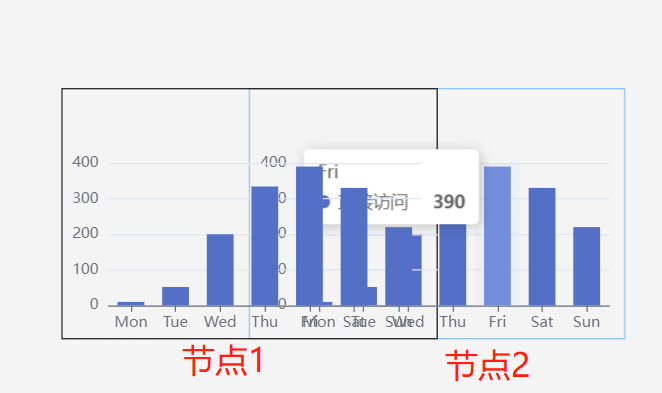

# 常见问题

<!-- ## 是否可以商用

基于开源协议 MIT 核心库自己开发的应用可以商用；

试用企业版非 MIT 项目，需要购买授权；

其他开发者作品参考开发者作品协议； -->

## 如何编译核心库源码

1. 下载核心库源码

```shell
git clone https://github.com/le5le-com/meta2d.js.git
```

2. 安装依赖包

```shell
// 使用yarn。我们使用的是yarn workspace目录结构
yarn
```

3. 编译(Build)

```shell
yarn build
// 编译后的文件在dist目录下
```

4. 使用  
   编译后的 js 包，参考[开发文档](../tutorial/start)使用

## 关于企业版

参考： [教程 - 企业版](../tutorial/commercial.html)

## 开源版有核心算法没开放

不是的。开源核心库开放了所有完整 API 能力，企业版是基于核心库做的上层 UI 封装。

为什么有不开源的企业版：1. 基于核心库能开发各式各样的丰富产品，我们企业版只是形态之一。2. 当然，也是为了项目和团队的更好的、长期的发展

## 动画只有 7 种吗

不是的，可以自定义扩展。

- 节点动画：在编辑器中选中节点，动效--动画--自定义，按照着帧的形式自定义动画效果。

- 连线动画：在编辑器中暂时只有 4 种。连线动画规则无法复用，自定义扩展需要基于开源核心库编码开发，欢迎联系我们。

## 如何集成到自己的 IoT 平台

- 仅大屏显示：参考教程[快速上手](../tutorial/start)即可

- 自己实现编辑器集成到平台：阅读本教程开发即可

- 使用企业版集成到平台：联系我们购买企业版源码，我们提供 1 年的技术支持

## 集成到自己的 IoT 平台，企业版编辑器右上角用户如何关联？

1. 在登录后，保存一个 localStorage.token 或 cookie.token，编辑器会把此 token 放到 http 请求头 headers.Authorization 中。平台后端自行验证此 token 身份即可。

- 如果把企业编辑器作为一个独立页，（登录成功后，回跳到编辑器）url 上带?token=your-token 参数，编辑器会自动保存 localStorage.token。

2. 按照我们的[API 接口文档](../tutorial/commercial-api)写一个用户接口，url path：/api/user/profile 即可

## 每新打开一个图纸必须重新填写 mqtt 的参数吗？可以和现有 IoT 系统通过接口整合吗？

不同的图纸 mqtt 地址和 topic 可能不同，因此默认每个图纸独立存储通信地址。保存文件时，会自动保存通信地址和参数设置，下次打开，无需再次设置。

如果 IoT 平台通信地址固定，可以修改编辑器源码在 meta2d.open 前，给图纸 json 赋值固定的通信地址即可，参考[实时数据监听](../tutorial/data)教程设置即可

## 如何绑定变量

1. 理解[实时数据监听原理](../tutorial/data)

- 我们有 3 种方式实现数据实时变化方式：  
  A、mqtt  
  B、websocket  
  C、meta2d.setValue(pen)

- 修改数据的本质是：找到 pen，修改 pen。我们通过 pen.id 或 pen.tag 定位 pen，然后把数据的其他属性赋值给 pen。例如：

```js
{
  id: 1, // 定位查找pen用
  text: '1' // 要修改的数据属性
}

{
  tag: 'tag1', // 定位查找pen用
  text: '1' // 要修改的数据属性
}
```

2. 绑定变量的本质，绑定需要定位的 id 或 tag。通常来说，id 是唯一的，不能随意修改的；tag 是可以任意添加的。因此，我们推荐的是绑定 tag：

```js
// tag列表来源于自己平台列表。选中一个变量绑定，等于添加一个tag
pen.tags.push('1号位置-温度传感器');

// 只要有数据给到meta2d，即可自动修改变化
{
  tag: '1号位置-温度传感器', // 定位查找pen用
  value: 36 // 要修改的数据属性
}
```

3. 如果是自己的数据格式，写一个中间件转换成 meta2d 格式即可。

## 鼠标框选错位

原因：

1. 父 dom 元素 css 还没渲染完，就加载画布，确认方式：new Meta2d 时，查看父 dom 的 clientWidth 和 clientHeight 是否存在；
2. 修改了父 dom 元素位置，可能是存在动画

解决方案：

1. 等待父 dom 元素 css 加载完成后在 new Meta2d
2. 确定画布位置已经稳定时，修正画布位置： meta2d.resize();

## drawImage width or height 0

原因：

父 dom 的宽高变成 0 了，常见于改变屏幕尺寸  
父 dom 的宽高度为 0 就 new Meta2d 了，可能是存在动画

解决方案：

1. 更改屏幕尺寸后，仍要保证父 dom 的宽高不为 0  
2. 等待父 dom 元素存在 clientWidth 和 再 clientHeight new Meta2d

## 脏数据处理

在一些场景下，偶发的会出现脏数据，目前原因不详。  
下面是一些解决方案：

### 场景一：与大部分画笔位置相差较远

视频讲解：
[如何处理脏数据-场景 1](https://www.bilibili.com/video/BV1NL4y1c7v7?spm_id_from=333.999.0.0)

确认方式：

1. meta2d.getRect() 宽度和高度很大，但有值。
2. 已点击窗口大小，但出现空白，或主体区域不在中心区域。

在设计上，画布是无限大的，如果你的主体部分在右下角，而左上角存在一个画笔，而且距离很远，最小缩放比又是一个固定值（老官网 0.3），那么使用**窗口大小（fitView）**，会使画布居中并且按照最小缩放比显示，但仍然看不到主体部分和左上角的画笔。  
显然在这种情况下，左上角的画笔并不是我们想要的，那么它变成了一个脏数据，是我们需要移除的。

解决方法：

1. 老官网: 已不再维护

窗口大小可实现该功能，但按前文所说，受到了最小缩放比的限制，所以我们把最小缩放比设置成 0 ，即允许继续缩放。  
在控制台执行下面代码

```js
meta2d.options.minScale = 0;
```

然后点击 **视图 窗口大小** 即可。

2. 官网：http://t.le5le.com/

操作可同上。
代码更改为：

```js
meta2d.store.options.minScale = 0;
```

新版本中存在缩略图（地图）功能，打开地图也可以看到。

## 图片置底后仍遮住其它图元

[图片层级](../tutorial/pens.html#图片层级)

## pen 或 pens 无 calculative 属性导致报错

确定 pens 是否从 [meta2d.data()](../api/core.html#data) 方法中取的，若是，改用 meta2d.store.data.pens 即可；若不是，欢迎群里讨论，在官网控制台发重现代码，截图。

## 预览画布

meta2d 是没有预览画布的 api 的，官方仅仅是在一个新的路由（页面），重新 new Meta2d ，将数据 open ，并 [lock](../api/core.html#lock).   
也可以有其他的做法，例如不跳新页面，仅仅隐藏除画布以外的内容，并且 lock ，注意此处情况可能带来[鼠标错位](./faq.html#鼠标框选错位)的问题。

## mqtt通信

mqtt支持两种协议，一种是tcp协议（mqtt开头），另一种是websocket协议（ws开头），而浏览器（b/s）只支持ws开头的协议，mqtt开头的协议一般是c/s架构使用，tcp协议和websocket协议的端口也不同，ws开头的协议端口为8083（wss为8084），专业的厂商 [EMQX](http://www.emqx.io/online-mqtt-client) 的产品也是这样做的。


## 多画布使用

```js
// 多个Meta2d实例

meta2d1 = new Meta2d()
meta2d2 = new Meta2d()
...

// 或  
new Meta2d();
meta2d1 = meta2d;
new Meta2d();
meta2d2 = meta2d;

// js脚本中，不能再简单直接的使用(window下的)meta2d了，而是根据情况用meta2d1或2
```

**参考例子：** https://github.com/le5le-com/meta2d.js/blob/main/examples/vue/src/components/Meta2dTwo.vue


## echrts节点的tooltip被其他eharts节点覆盖



如图所示，节点2的tooltip被节点1覆盖<br/>
原因：echarts的父元素设置了transform导致层叠规则的改变,子元素设置z-index对其他层级无效。<br/>
解决方案：在index.html中添加如下代码,取消单独分层。缺点：导致该echarts dom元素无法和该节点框同步旋转。
```css
<style>
  div[_echarts_instance_]{
      transform: none !important;
  }
</style>
```

## 其他问题

其他问题，欢迎联系我们：

Github： https://github.com/le5le-com/meta2d.js/issues

交流群： [交流群](../community/wechat.html)

Email： business@le5le.com

<br><br><br><br><br><br><br><br><br><br><br><br><br><br><br><br>
